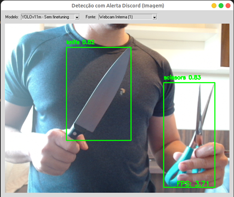

# 🛡️ FIAP VisionGuard: MVP para detecção supervisionada de objetos cortantes

Este projeto utiliza a biblioteca Ultralytics YOLO e OpenCV para detectar objetos específicos (configurado inicialmente para facas e tesouras) em tempo real a partir de uma webcam ou outra fonte de vídeo. Ele fornece uma interface gráfica simples (Tkinter) para selecionar dinamicamente o modelo YOLO e a fonte de vídeo, exibe a contagem de FPS e envia alertas para um canal do Discord configurado via webhook sempre que um objeto de alerta é detectado acima de um limiar de confiança, incluindo uma imagem do momento da detecção.
## Descrição do Projeto

Este projeto utiliza a biblioteca **Ultralytics (8.3) YOLOv11** em conjunto com **OpenCV** para detectar objetos específicos em tempo real, como **facas** e **tesouras**, a partir de uma **webcam**, stream **RTSP** ou qualquer outra fonte de vídeo. 

A aplicação oferece uma interface gráfica simples (Tkinter) para selecionar dinamicamente o modelo YOLO (`.pt`) e a fonte de vídeo. Ela também exibe a taxa de FPS atual e envia alertas automáticos para um canal do Discord sempre que um objeto de interesse é detectado acima de um limiar de confiança, incluindo um snapshot do momento da detecção.

O modelo contém um treinamento preparado com datasets **RoboFlow** e um subconjunto filtrado do **dataset COCO 2017**. Este último contendo apenas classes relevantes como `knife`, `scissors` e `fork`.

As detecções e os alertas são processados de forma assíncrona, garantindo fluidez na interface e desempenho estável mesmo sem GPU.

## 🚀 Objetivos alcançados

### Detecção de Objetos em Tempo Real
- Baseada em **YOLOv11** (Ultralytics) para detectar objetos com precisão.
- Exibe a **taxa de FPS** atual diretamente na interface.

### Interface Gráfica (GUI)
- Desenvolvida com **Tkinter**, leve e nativa.
- **ComboBox** para:
  - Seleção de modelos `.pt` dinamicamente
  - Alternar entre **webcams locais** ou **streams RTSP**

### Integração com Discord (Alertas em Tempo Real)
- Envia alertas quando objetos específicos são detectados.
- **Snapshot do frame** incluído automaticamente no alerta.
- Comportamentos configuráveis:
    `ALERT_CLASSES` – classes que disparam alerta
    `ALERT_THRESHOLD` – nível de confiança mínimo
    `ALERT_COOLDOWN_SECONDS` – tempo de espera entre alertas

### Operações Assíncronas
- Modelos e alertas são processados em **threads paralelas**, mantendo a interface fluida.
- Interface **não bloqueia** durante detecção nem envio de alertas.

### Configurável e Extensível (início do script)
    ✅ Caminho para modelos  
    ✅ Lista de classes monitoradas  
    ✅ Webhook do Discord  
    ✅ Limiar de confiança  

### Exemplos de Aplicação
- Sistemas de monitoramento inteligente
- Ambientes com alto risco (escolas, hospitais, aeroportos)
- Detecção de objetos cortantes ou suspeitos  

## 📁 Estrutura de Pastas
    ├── pytorch_models      - modelos treinados com datasets públicos
    ├── images              - imagens da documentação
    ├── data                - vídeos de avaliação
        └── inputs  
        └── outputs  
    ├── main.py             - arquivo principal

## Funcionalidades

- **Detecção de Objetos em Tempo Real:** Usa modelos YOLOv8 (ou outros compatíveis com Ultralytics) para detecção.
- **Interface Gráfica (GUI):** Construída com Tkinter para interação do usuário.
- **Seleção Dinâmica de Modelo:** Permite trocar o modelo YOLO `.pt` em tempo de execução através de um ComboBox.
- **Seleção Dinâmica de Fonte de Vídeo:** Permite alternar entre diferentes webcams ou fontes de vídeo (incluindo URLs RTSP) através de um ComboBox.
- **Exibição de FPS:** Mostra a taxa de quadros por segundo atual no canto da tela.
- **Alertas Configuráveis no Discord:**
  - Envia uma notificação para um webhook do Discord quando objetos específicos (`ALERT_CLASSES`) são detectados com confiança acima de um limiar (`ALERT_THRESHOLD`).
  - **Inclui Snapshot:** Anexa uma imagem `.png` do frame no momento da detecção ao alerta do Discord.
  - **Cooldown:** Possui um tempo de espera configurável (`ALERT_COOLDOWN_SECONDS`) entre alertas para evitar spam.
- **Operações Assíncronas:** Carregamento de modelos e envio de alertas para o Discord são feitos em threads separadas para não bloquear a interface do usuário.
- **Configurabilidade:** Várias opções (modelos, fontes, limiares, webhook) podem ser facilmente ajustadas no início do script Python.

## Setup Inicial (Usando Conda)
